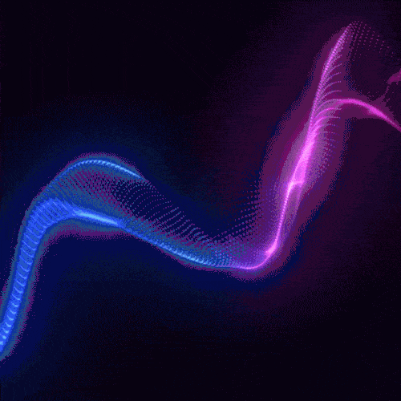

# resonance

<!--
run backend - npx convex dev
run frontend - npm run dev
-->

<!-- PROJECT LOGO -->
<br />
<div align="center" id='readme-top'>
  

  <h3 align="center">Resonance</h3>

  <p align="center">
    Collaborate on the same wavelength
    <br />
    <br />
    <a href="https://github.com/WackyChomp/resonance"><strong>Explore the docs »</strong></a>
    <br />
    <a href="https://github.com/WackyChomp/resonance">View Demo</a>
    ·
    <a href="https://github.com/WackyChomp/resonance/issues">Report Bug</a>
    ·
    <a href="https://github.com/WackyChomp/resonance/issues">Request Feature</a>
  </p>
</div>

<br />


<!-- TABLE OF CONTENTS -->
<details>
  <summary>Table of Contents</summary>
  <ol>
    <li>
      <a href="#about-the-project">About The Project</a>
    </li>
    <li><a href="#folder-structure">Folder Structure</a></li>
    <li><a href="#roadmap">Roadmap</a></li>
    <li><a href="#acknowledgments">Acknowledgments</a></li>
    <li><a href="#"></a></li>
    <li><a href="#"></a></li>
  </ol>
</details>


## About The Project
Need an environment to simultaneously design and prototype new ideas? Look no further with <u><b>Resonance</b></u>

Being able to interact with others remotely on a virtual whiteboard in real-time is not only engaging but incredibly convenient.

Sure you can plan and draw out your vision with pen and paper but there are physical limitations with this approach:

- Running out of space while being in the midst of the creative process may results in setback and disrupt workflow.
- Imagine huddling in a group activity/project and trying to share your ideas openly while being mindful of their physical boundary.
- Juggling multiple ideas/projects and trying to keep them in their respective places without overlapping or accidental crossover


<p align="right">(<a href="#readme-top">back to top</a>)</p>

<br />


## Built With
Here are some frameworks/libraries used in this project:
* [![TypeScript][TypeScript]][TypeScript-url]
* [![Tailwind][Tailwind.css]][Tailwind-url]
* [![React][React.js]][React-url]
* [![Next][Next.js]][Next-url]

<p align="right">(<a href="#readme-top">back to top</a>)</p>

<br/>

## Folder Structure
General overview of folder/files
```
| - app/
    |-- (dashboard)/
      |-- (_components)/
      |-- layout.tsx
      |-- page.tsx
    |-- globals.css
    |-- layout.tsx
| - components/
    |-- auth/
    |-- ui/
| - convex/
| - lib/
| - providers/
| - public/
```

<p align="right">(<a href="#readme-top">back to top</a>)</p>

<br/>

## Roadmap
<h3>Features (WIP Todo)</h3>

- [] Establish dashboard layout
- [] Authentication with Clerk
- [] Finalize color themes
- [] Working query search in navbar
- [] Mobile responsive
- []
- []

<p align="right">(<a href="#readme-top">back to top</a>)</p>


<!-- ACKNOWLEDGMENTS -->
## Acknowledgments

List of wonderful resources and credits to: 
* [Malven's Flexbox Cheatsheet](https://flexbox.malven.co/)
* [Malven's Grid Cheatsheet](https://grid.malven.co/)
* [Font Awesome](https://fontawesome.com)
* [Badge Shield](https://dev.to/envoy_/150-badges-for-github-pnk)
<br><br>
* [Tailwind CSS](https://tailwindcss.com/docs/installation) - CSS framework
* [Next.js](https://nextjs.org/docs/getting-started/installation) - React Framework
* [Clerk](https://clerk.com/) - Authentication + User Management
* [Shadcn/ui](https://ui.shadcn.com/docs) - Customizable UI components

<p align="right">(<a href="#readme-top">back to top</a>)</p>


<!-- MARKDOWN LINKS & IMAGES
https://www.markdownguide.org/basic-syntax/#reference-style-links

https://github.com/Envoy-VC/awesome-badges
-->
[Next.js]: https://img.shields.io/badge/next.js-000000?style=for-the-badge&logo=nextdotjs&logoColor=white
[Next-url]: https://nextjs.org/
[TypeScript]: https://img.shields.io/badge/TypeScript-007ACC?style=for-the-badge&logo=typescript&logoColor=white
[TypeScript-url]: https://www.typescriptlang.org/

[React.js]: https://img.shields.io/badge/React-20232A?style=for-the-badge&logo=react&logoColor=61DAFB
[React-url]: https://reactjs.org/
[Tailwind.css]: https://img.shields.io/badge/Tailwind_CSS-38B2AC?style=for-the-badge&logo=tailwind-css&logoColor=white
[Tailwind-url]: https://tailwindcss.com/
[Material-UI]: https://img.shields.io/badge/Material--UI-0081CB?style=for-the-badge&logo=material-ui&logoColor=white
[Material-UI-url]: https://mui.com/material-ui/getting-started/overview/


[sound-wave-url]: https://gifdb.com/images/high/incredible-sound-wave-art-hxgh3rtf5v8vvh5i.gif